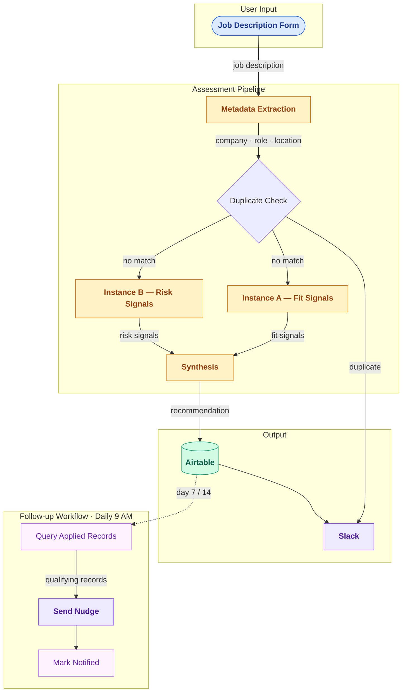

# LokisWand

Design-first is the only way to build AI systems worth building.

LokisWand is a job application intelligence pipeline built in n8n. The interface contract, all data schemas, all prompt directives, and every architectural decision were locked before a single workflow node was constructed. This is not a best practice — it is the only practice that produces AI outputs you can reason about.

---

## What LokisWand Does

Paste a job description into a form. That is the entire recurring user action.

LokisWand processes the submission through three stages. First, Claude extracts structured metadata from the job description text — company, role title, location, and employment type. Second, two Claude instances run in parallel: one identifies fit signals (evidence the candidate is a strong match), the other identifies risk signals (evidence of gaps or mismatches). Third, a synthesis Claude instance reconciles the two assessments, resolves genuine conflicts, collapses false ones, and concludes with a fixed four-value recommendation: **Strong Fit**, **Moderate Fit**, **Weak Fit**, or **Do Not Apply**.

Every submission lands in an Airtable kanban board with the full assessment record. A separate workflow runs daily at 9 AM and sends Slack reminders for any Applied applications that have passed the 7-day or 14-day follow-up window.

---

*Amber = Claude API call · Green = Airtable · Purple = Slack notification · Blue = user entry · Violet = follow-up state*

---

## Why the Design Matters

**Dual assessment, not single assessment.** One Claude instance evaluating candidate fit produces one perspective. Two instances with differentiated tasks — one constrained to fit signals, one to risk signals — produce genuine variance. The third synthesis call then does real analytical work on inputs that actually differ.

**Deferral over forced output.** Both assessment instances are explicitly permitted to defer to synthesis if no genuine signals exist. A strong candidate against a perfectly matched role should produce no meaningful risk signals — Instance B should say so rather than inventing three. The synthesis agent treats a deferral as meaningful evidence of strong fit, not an error. This design choice eliminates manufactured assessments.

**Synthesis as analytical work.** The third call is not a summary. It resolves genuine conflicts, collapses apparent conflicts that are not real, incorporates deferral evidence, and concludes with a concrete actionable recommendation. A hedged output is not a recommendation.

**Minimum viable user input.** One-time profile setup. One paste per application. Nothing else.

---

## How It Was Built

LokisWand was built design-first. Domain learning came first, followed by a Socratic design pass to resolve every architectural decision before anything was specified. The interface contract — every component's inputs, outputs, data types, and failure behaviors — was written before the masterplan. The masterplan was written before any workflow node was built.

Claude was used as a Socratic design partner throughout the design phase: challenging reasoning, surfacing gaps, presenting alternatives with tradeoffs. Every architectural judgment and design choice belongs to the developer. That methodology is the primary signal this project demonstrates — not the stack.

The design artifacts are version-stable. The n8n workflow is intentionally disposable and can be rebuilt from the interface contract if n8n changes or the architecture evolves.

---

## Companion Documents

- **[DESIGN.md](DESIGN.md)** — architecture and system design. Start here if you want to understand how the system thinks.
- **[INTERFACE_CONTRACT.md](INTERFACE_CONTRACT.md)** — every component's inputs, outputs, and data types. The stable contract the code was built against.
- **[DESIGN_DECISIONS.md](DESIGN_DECISIONS.md)** — every major decision with its reasoning and rejected alternatives documented. The clearest signal of how design tradeoffs were evaluated.
- **[prompts/README.md](prompts/README.md)** — index of the prompt and methodology files that governed how the system was designed and documented.

---

## Stack

| Component | Tool |
|---|---|
| Workflow automation | n8n (cloud) |
| AI assessment | Anthropic Claude API (claude-opus-4-7) |
| Data storage and tracking | Airtable |
| Notifications | Slack |

---

## Setup

### Prerequisites

- n8n cloud account (cloud required for reliable follow-up nudge scheduling)
- Airtable account with a personal access token
- Anthropic API key
- Slack workspace with an incoming webhook URL

### Steps

1. **Clone this repository**

2. **Create the Airtable base**
   - Create a base named LokisWand with one table: Applications
   - Add all fields exactly as specified in [INTERFACE_CONTRACT.md](INTERFACE_CONTRACT.md) — field names and types are case-sensitive
   - Create a kanban view grouped by the Status field

3. **Configure n8n credentials and variables**
   - Add your Airtable Personal Access Token as a credential in n8n
   - Add your Anthropic API key as a credential in n8n
   - Add a variable named `SLACK_WEBHOOK_URL` in n8n Settings → Variables with your Slack incoming webhook URL

4. **Import workflows**
   - Import `workflows/loki_core_pipeline.json`
   - Import `workflows/loki_followup_nudge.json`
   - Update credentials in both workflows to match your configured credentials
   - Activate both workflows

5. **Generate your candidate profile**
   - Open `profile/loki_conversion_prompt.md`
   - Paste the conversion prompt and your master resume into a Claude conversation
   - Review the output — verify everything in the Review Required section
   - Save as `profile/loki_candidate_profile.md`
   - Paste the full profile text into the Load Profile Document code node in the core pipeline workflow

### Demo story

1. Open the n8n form trigger URL and paste any job description
2. The pipeline runs: metadata extraction → duplicate check → parallel dual assessment → synthesis → Airtable write → Slack confirmation
3. Open Airtable to see the full record: fit signals, risk signals, synthesis output, and recommendation
4. Set the record's Status field to Applied
5. Manually trigger the follow-up nudge workflow — if the record's date submitted is 7 or more days ago, a Slack message fires and the checkbox updates
