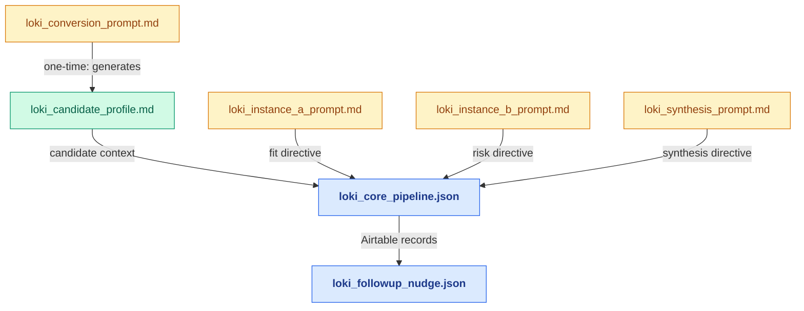

# walkthrough/

This directory contains annotated design rationale documents for every source file in LokisWand. Each file explains why the implementation is written the way it is — not what it does. Readers who want to understand what the system does should start with [DESIGN.md](../DESIGN.md) and [INTERFACE_CONTRACT.md](../INTERFACE_CONTRACT.md). Readers who want to understand why specific implementation choices were made should read the files here.

---

*Amber = prompt/directive · Green = profile document · Blue = n8n workflow. Arrows show which files feed into which.*

---

## Source files covered

| Walkthrough file | Source file |
|---|---|
| [loki_core_pipeline.md](loki_core_pipeline.md) | `workflows/loki_core_pipeline.json` |
| [loki_followup_nudge.md](loki_followup_nudge.md) | `workflows/loki_followup_nudge.json` |
| [loki_candidate_profile.md](loki_candidate_profile.md) | `profile/loki_candidate_profile.md` |
| [loki_conversion_prompt.md](loki_conversion_prompt.md) | `profile/loki_conversion_prompt.md` |
| [loki_instance_a_prompt.md](loki_instance_a_prompt.md) | `prompts/project/loki_instance_a_prompt.md` |
| [loki_instance_b_prompt.md](loki_instance_b_prompt.md) | `prompts/project/loki_instance_b_prompt.md` |
| [loki_synthesis_prompt.md](loki_synthesis_prompt.md) | `prompts/project/loki_synthesis_prompt.md` |

---

## Reading order

Start with the workflows if you want to understand execution flow. Start with the prompt files if you want to understand LLM design decisions. The candidate profile and conversion prompt are best read together as the setup pair.

**Execution flow:** `loki_core_pipeline` → `loki_followup_nudge`

**Assessment chain:** `loki_instance_a_prompt` + `loki_instance_b_prompt` → `loki_synthesis_prompt`

**Setup pair:** `loki_conversion_prompt` → `loki_candidate_profile`
